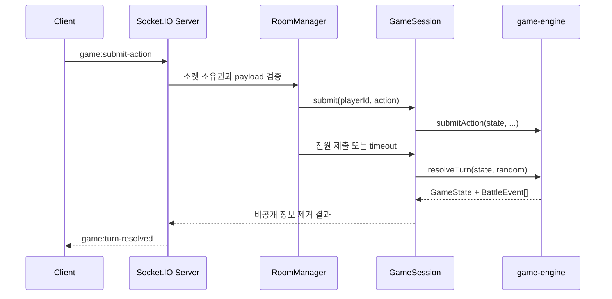

# BLIND TURN 아키텍처

## 패키지 경계

```text
apps/web ───────────────┐
                       ↓
apps/server → packages/shared → packages/game-engine
```

`game-engine`은 React, Next.js, Socket.IO, 브라우저 저장소에 의존하지 않는다. 온라인 서버도 전투 규칙을 복사하지 않고 `createGame`, `startTurn`, `submitAction`, `resolveTurn`을 호출한다.

## 서버 권한형 구조

클라이언트가 제출할 수 있는 값은 닉네임, 방 코드, 준비 상태, 행동 종류와 대상, 재경기 요청뿐이다. 체력, 생존 여부, 주사위, 행동 순서, 피해와 승패는 서버가 결정한다.



## RoomManager 책임

- 고유 6자리 방 코드와 좌석 발급
- 2~6인 입장, 닉네임 중복, 준비 및 방장 권한 검증
- `playerId`, `reconnectToken`, 현재 `socketId`의 소유권 연결
- 행동 제한 시간과 이벤트 재생 최대 대기 시간 관리
- 로비 개별 연결 해제 30초 유예, 전원 연결 해제 방 10분 유예, 방장 위임과 방 정리
- 마지막 제출과 타이머가 겹쳐도 한 번만 판정하도록 조정

## GameSession 책임

- 기존 게임 엔진의 `GameState` 보관
- 턴 번호, 생존, 제출 중복, 대상과 연속 반격 검증
- 시간 초과 플레이어에게 효과 없는 `PASS` 제출
- 한 턴당 `resolveTurn()` 한 번만 호출
- 공개 이벤트와 최종 공개 스냅샷 생성
- 결과 확인 완료 플레이어 추적과 다음 턴 시작

## 플레이어별 상태 필터링

`createPlayerView(room, viewerPlayerId)`는 각 소켓에 별도 뷰를 만든다.

공개되는 값:

- 모든 플레이어의 닉네임, 좌석, 연결·준비, 체력·생존, 제출 여부
- 자신의 속도와 제출 행동
- 현재 턴, 단계, 행동 제한 시간, 공개 결과

제거되는 값:

- 다른 플레이어의 속도와 행동·대상
- 모든 숨김 동률 주사위
- 서버 난수 상태와 재접속 토큰

`SPEED_ROLLED`는 공개 전투 이벤트에서 제거한다. 합과 회피 주사위는 턴 판정 이후 연출할 공개 결과에만 포함된다.

## 재접속

Socket ID는 플레이어 ID로 사용하지 않는다. 입장 시 받은 `playerId`와 `reconnectToken`을 브라우저 localStorage에 저장한다. 새 소켓이 토큰을 검증받으면 기존 세션의 `socketId`만 교체하고 개인 속도, 제출 행동, 제한 시간을 포함한 최신 뷰를 다시 보낸다.

## 중복 판정 방지

`GameSession`은 해결 중 잠금과 마지막 해결 턴 번호를 보관한다. `RoomManager`가 마지막 제출과 시간 초과 콜백에서 동시에 해결을 요청해도 현재 턴은 첫 호출에서만 처리된다. 방·재경기 삭제 시 관련 타이머를 모두 해제한다.

전투 엔진 또는 다음 턴 타이머에서 예상하지 못한 예외가 발생하면 해당 방을 `FINISHED`로 전환하고 `GAME_ENGINE_FAILURE`를 전달한다. 진행 중 상태로 무한 대기시키지 않으며 방장은 같은 참가자로 재경기를 준비할 수 있다.

## 다음 턴 동기화

클라이언트는 이벤트 재생 완료 또는 건너뛰기 후 `game:events-finished`를 보낸다. 연결된 생존자 전원이 완료하면 즉시 다음 턴을 시작하며, 연결 해제로 영구 대기하지 않도록 8초 후 서버가 자동 진행한다.

## 배포 경계

현재 방과 재접속 세션은 서버 메모리에만 존재한다. 여러 서버 프로세스로 확장하려면 Redis 어댑터, 공유 방 저장소, 고정 세션 라우팅이 추가로 필요하다.
