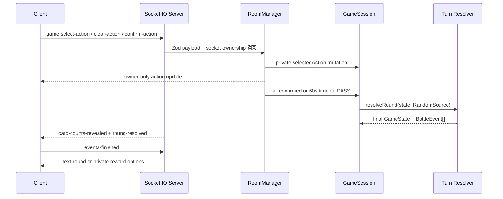

# BLIND TURN V2 아키텍처

## 의존 방향

```text
apps/web ───────────────┐
                       ↓
apps/server → packages/shared → packages/game-engine
```

`game-engine`은 React, Socket.IO, 브라우저와 분리된 순수 TypeScript 모듈입니다. 카드/캐릭터 정의, 덱 조작, 단일 행동 검증, 성장과 `resolveRound` 판정이 이 패키지에 있습니다.

## 서버 권한 흐름



클라이언트는 HP, 덱, 주사위나 판정 결과를 제출할 수 없습니다. 서버가 닉네임과 playerId를 세션에서 가져오므로 채팅 신원도 위조할 수 없습니다.

## 엔진 상태

`PlayerState.deckState`가 각 플레이어 카드 상태의 단일 원본입니다.

- `drawPile`, `hand`, `discardPile`, `permanentlyRemovedCards`
- `selectedAction: SelectedTurnAction | null`
- `confirmed`: `selectedAction === null`인 채 확정하면 `PASS`
- `pendingRewardOptions`, `selectedRewardCardIds`, `rewardConfirmed`
- `requiredRemovalCount`, `selectedRemovalInstanceIds`, `newlyAddedCardInstanceIds`, `deckRemovalConfirmed`

전술가 전용 시작 손패 선택 상태는 없습니다. 모든 직업이 같은 초기 10장/손패 5장 경로를 사용합니다.

`GameState.phase`는 `ROUND_STARTING → SELECTING_CARDS → RESOLVING_ROUND → (SELECTING_REWARD → SELECTING_DECK_REMOVAL) → ROUND_STARTING`으로 이동합니다. 내부 호환성을 위해 phase와 일부 이벤트 이름에 `ROUND`가 남아 있지만 제품 UI와 규칙의 한 단위는 턴입니다.

## 단일 턴 동시성

`resolveRound`는 각 생존자의 `selectedAction`을 한 번 수집합니다. 턴 시작 HP를 고정한 뒤 상호 공격 합, 반격, 회피, 방어, 유틸리티를 계산하고 모든 회복/피해를 한꺼번에 반영한 뒤 사망을 처리합니다.

따라서 같은 턴에 사망하는 플레이어도 이미 확정한 행동을 실행합니다. 합 패자는 현재 공격만 실패하며 이후 행동 취소 상태나 `stepIndex`는 존재하지 않습니다.

## 소켓 계약

클라이언트 → 서버의 행동 변경 계약은 세 개뿐입니다.

```ts
"game:select-action": {
  roomCode: string;
  roundNumber: number;
  cardInstanceId: string;
  targetPlayerId?: string;
  additionalSelection?: SelectedActionAdditionalSelection;
}

"game:clear-action": { roomCode: string; roundNumber: number }
"game:confirm-action": { roomCode: string; roundNumber: number }
```

이전 `queue-card`, `move-queued-card`, `remove-queued-card`, `reorder-queued-cards`, `confirm-round`, `select-initial-hand` 이벤트는 제거했습니다.

## 공개/비공개 뷰

`createPlayerView(room, viewerPlayerId)`가 소켓별 뷰를 만듭니다.

공개 정보:

- 닉네임, 좌석, 캐릭터, 연결/준비, HP/생존
- 손패/뽑기/버림/전체 덱/영구 제거 장수와 행동 확정 여부
- 잠금 후 사용 카드 장수, 공개 BattleEvent, 결과, 채팅

본인 전용 정보:

- 손패/버린 카드의 instanceId와 정의
- 뽑기 더미 종류별 집계와 전체 덱 위치별 집계
- `mySelectedAction`의 카드, 대상과 추가 선택
- 성장 후보 3장 또는 4장, 현재 2장 선택과 제한 시간
- 제거 카드 상세와 선택 상태

상대의 손패 카드, 선택 행동, 대상, 성장 후보/선택과 서버 난수 상태는 공개하지 않습니다.

## 전술가 성장 후보

일반 직업은 직업 2 + 공용 1, 전술가는 직업 3 + 공용 1을 생성합니다. 옵션 배열 길이는 하드코딩하지 않습니다. 카드별 보유 제한을 적용한 뒤 후보를 중복 없이 만들며, 전술가 직업 후보가 부족하면 공용 카드로 채웁니다. 어느 직업이든 `requiredSelectionCount`는 2입니다.

`RewardSelectionState`에는 턴 번호, 가변 길이 options, 현재 selectedCardIds, 선택 필요 수 2, deadlineAt을 포함합니다. 이 상태는 소켓별 개인 뷰에만 포함되고 재접속 때 그대로 복원됩니다.

## 타이머와 중복 방지

- 행동 선택: 60초, 미확정 플레이어는 `PASS`
- 전투 재생: 연결 플레이어 완료 신호 또는 45초 후 자동 진행
- 성장/덱 제거: 각각 60초, 서버 RandomSource로 자동 처리
- 연결 해제: 30초 유예, 전원 이탈 방은 10분 후 삭제

마지막 확정과 timeout이 겹쳐도 `GameSession.lastResolvedRound`와 resolving 잠금이 같은 턴을 한 번만 해결합니다.

## Combat Playback

서버는 `TURN_RESOLUTION_STARTED`부터 `TURN_RESOLUTION_FINISHED`까지 한 턴의 원본 이벤트 범위를 전달합니다. 클라이언트의 `buildCombatSequences`는 이 범위를 하나의 `TURN` 시퀀스로 묶습니다.

재생 훅 하나가 공개, 대상 강조, 판정, 피해/회복, 사망, 요약을 순서대로 진행합니다. `serverState`는 최종 확정 상태이고 `displayState`는 현재 재생 단계까지만 반영한 상태입니다. 건너뛰기는 타이머를 정리하고 최종 `serverState`와 동기화합니다. 1/1.5/2배속과 `prefers-reduced-motion`을 지원합니다.

서버 프로세스 재시작 후에는 메모리 방이 사라지므로 복구할 수 없습니다. 다중 인스턴스에는 공유 방 저장소, Redis Socket.IO adapter와 고정 세션 전략이 필요합니다.
