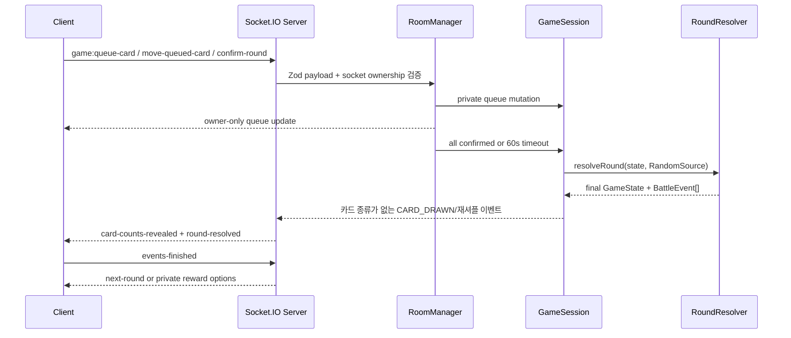

# BLIND TURN V2 아키텍처

## 의존 방향

```text
apps/web ───────────────┐
                       ↓
apps/server → packages/shared → packages/game-engine
```

`game-engine`은 React, Socket.IO, 브라우저와 분리된 순수 TypeScript 모듈입니다. 카드 정의, 캐릭터 정의, 덱 조작, 큐 검증, 보상과 `resolveRound` 판정이 이 패키지에 있습니다.

## 서버 권한 흐름



클라이언트는 HP, 덱, 주사위나 판정 결과를 제출할 수 없습니다. 서버가 세션의 닉네임과 playerId를 사용하므로 채팅도 신원을 위조할 수 없습니다.

## 엔진 상태

`PlayerState.deckState`가 각 플레이어 카드의 단일 원본입니다.

- `drawPile`, `hand`, `discardPile`, `permanentlyRemovedCards`
- `queuedCards`: 확정 전 0~3장과 명시적 단계(0~2), 대상/추가 선택
- `confirmed`
- `pendingInitialHandSelection`: 전술가 시작 후보 6장
- `pendingRewardOptions`, `selectedRewardCardIds`, `rewardConfirmed`
- `requiredRemovalCount`, `selectedRemovalInstanceIds`, `newlyAddedCardInstanceIds`, `deckRemovalConfirmed`

`GameState.phase`는 `ROUND_STARTING → SELECTING_CARDS → RESOLVING_ROUND → (SELECTING_REWARD → SELECTING_DECK_REMOVAL) → ROUND_STARTING`으로 이동하며 생존자가 1명 이하이면 `FINISHED`가 됩니다.

## 단계 동시성

`resolveRound`는 큐의 order 0, 1, 2를 `StepResolver`에 전달합니다. 한 단계는 다음 순서로 계산합니다.

1. 단계 시작 시 생존/대상 상태를 고정하고 카드를 동시에 공개
2. 상호 공격 합, 지정 반격, 회피, 방어와 유틸리티 계산
3. 단계 시작 HP를 기준으로 회복과 모든 피해를 모음
4. HP를 동시에 갱신한 뒤 사망 처리
5. 다음 단계부터 사망자 카드 또는 사망 대상을 취소

따라서 이번 단계에서 치명 피해를 받는 플레이어의 같은 단계 행동은 실행되지만 이후 예약 행동은 실행되지 않습니다. `RoundResolver`는 좌석 순서를 결과 결정의 대체 우선순위로 사용하지 않으며, 합 동률만 재굴림합니다.

## 공개/비공개 뷰

`createPlayerView(room, viewerPlayerId)`가 소켓별 뷰를 만듭니다.

공개:

- 닉네임, 좌석, 캐릭터, 연결/준비, HP/생존
- 손패/뽑기/버림/전체 덱/영구 제거 장수와 확정 여부
- 라운드 잠금 이후에만 사용 카드 장수
- 완료된 공개 BattleEvent, 결과, 채팅

본인 전용:

- 손패/버린 카드의 instanceId와 정의
- 뽑기 더미의 카드 종류별 수량 집계와 전체 덱 위치별 집계
- 큐의 카드, 순서, 대상과 추가 선택
- 전술가 시작 선택지, 보상 후보와 현재 2장 선택
- 제거 카드 상세, 선택 상태, 이번 성장에서 추가되어 제거 불가능한 카드
- 영구 제거 카드 상세

미공개:

- 상대 손패/큐/대상/순서
- 뽑기 더미 순서와 서버 난수 상태
- reconnectToken과 전체 GameState

`CARD_DRAWN`과 재셔플 이벤트에는 카드 종류나 순서가 없고 장수만 들어갑니다. 상대 뷰에는 더미별 장수만 제공되며, 합/회피 주사위는 판정 후에만 공개됩니다.

## RoomManager와 타이머

- 행동 선택: 서버 기준 60초. 미확정 플레이어는 카드 0장으로 확정
- 전투 재생: 연결된 플레이어의 완료 신호 또는 45초 후 자동 진행
- 보상/덱 제거: 서버 기준 각각 60초. 미선택은 서버가 서로 다른 보상 2장/필요한 기존 카드를 자동 적용
- 로비 연결 해제: 30초 뒤 제거
- 전원 연결 해제 방: 10분 뒤 삭제

마지막 확정과 timeout이 겹쳐도 `GameSession.lastResolvedRound`와 resolving 잠금으로 같은 라운드를 한 번만 해결합니다. 방 삭제/재경기/서버 종료 시 action, playback, reward, cleanup, disconnect 타이머를 정리합니다.

## 재접속과 재생 복구

Socket ID와 playerId를 분리합니다. 브라우저는 `roomCode`, `playerId`, `reconnectToken`만 localStorage에 저장합니다. 토큰 검증 후 서버는 소켓 소유권을 교체하고 본인 손패/큐/성장 2장 선택/덱 정리 선택/영구 제거/기한/최근 채팅을 복원합니다. 전투 재생 도중이면 `pendingRoundPlayback`도 전달해 최종 HP로 즉시 건너뛰지 않고 해당 라운드를 다시 재생할 수 있습니다.

## Combat Playback 박자

클라이언트 재생 관리자는 `PLAYBACK_BEAT_MS = 600`을 단일 시간 원본으로 사용합니다. 단계 시작, 같은 단계 카드 일괄 공개, 대상 강조, 판정, 단계 단위 동시 HP 적용, 결과 유지와 전환이 정수 박자로 순차 실행됩니다. 합은 서버의 `CLASH_ROLLED` 이벤트를 재굴림 회차별로 묶고 첫 번째 룰렛/결과, 두 번째 룰렛/결과, 보정, 비교, 동률 또는 승자를 각각 독립 박자로 재생합니다. CSS 룰렛은 서버 결과로 끝나는 결정적 프레임만 표시하며 난수를 만들지 않습니다. 1/1.5/2배속은 컨트롤러 대기 시간과 CSS custom property에 동일하게 적용되며, 건너뛰기는 남은 타이머를 정리하고 HP/덱 displayState를 서버 확정 상태로 맞춥니다.

서버 프로세스 재시작 후에는 메모리 방이 사라지므로 복구할 수 없습니다. 다중 인스턴스에는 공유 방 저장소, Redis Socket.IO adapter와 고정 세션 전략이 필요합니다.
